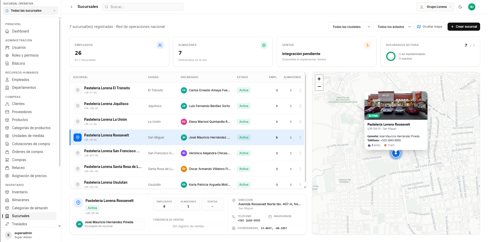
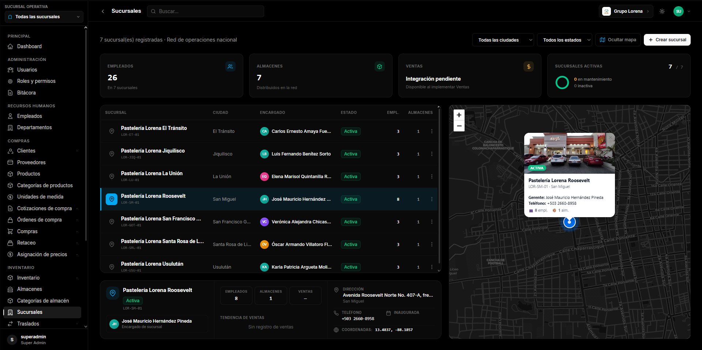
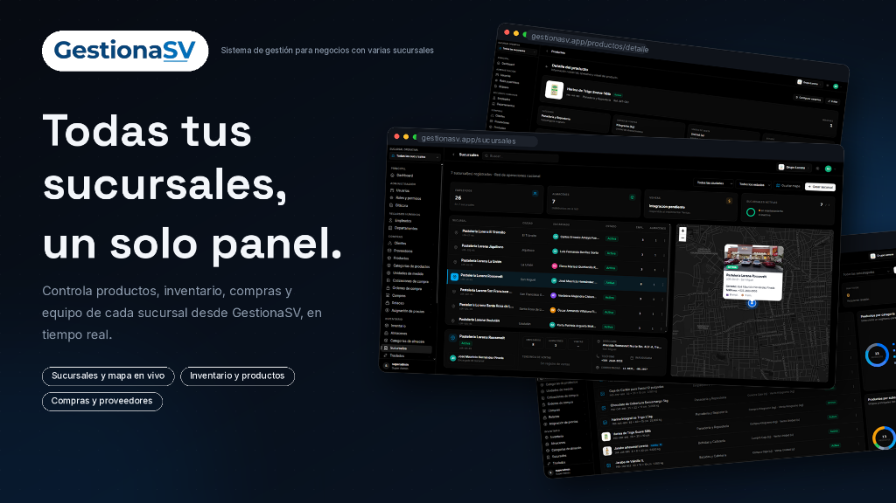

Sistema ERP modular construido con **FastAPI + SvelteKit 5 + PostgreSQL 16**.
Autenticación JWT con rotación de refresh tokens, RBAC dinámico administrable,
bitácora append-only, gestión de empleados y departamentos, catálogo de
productos y proveedores, inventario operativo, biblioteca documental con RustFS,
ClamAV y OCRmyPDF, además de observabilidad local con OpenTelemetry y Grafana.
La navegación contiene 15 entradas funcionales y 14 módulos futuros preparados
como mockups en el sidebar.

---

## Vista Previa

| Modo Claro | Modo Oscuro |
| :---: | :---: |
|  |  |

<br>



---

## Stack

| Layer       | Technology |
|-------------|------------|
| Backend     | Python 3.12, FastAPI (async), SQLAlchemy 2.0 async, Alembic, Pydantic v2, asyncpg, structlog, Argon2id, PyJWT |
| Frontend    | SvelteKit (Svelte 5 runes), TypeScript strict, TailwindCSS, Vitest, design system Geist (Vercel) |
| Database    | PostgreSQL 16 |
| Infra       | Docker Compose v2, RustFS, ClamAV, Redis/ARQ, OCRmyPDF, OpenTelemetry, Grafana, Prometheus, Loki, Tempo y Nginx |
| Tooling     | `uv` (backend deps), `pnpm` (frontend deps), `make` |

---

## Quick start — un solo comando

Requisitos: **Docker** (con Compose v2) y **Git**. Nada más.

```bash
git clone <repo-url> erp-system && cd erp-system
make setup
```

O sin Make:

```bash
git clone <repo-url> erp-system && cd erp-system
cp .env.example .env
docker compose up -d --build
```

En Windows PowerShell, use `Copy-Item .env.example .env` en lugar de `cp`.
Docker Compose
espera las migraciones, ejecuta la semilla de primer setup y levanta el frontend
solamente cuando la base queda lista.

`make setup` hace todo automáticamente:

1. Copia `.env.example` → `.env`
2. Genera credenciales locales y levanta PostgreSQL, procesamiento documental, backend, frontend y observabilidad
3. Espera a que Postgres esté healthy
4. Ejecuta migraciones Alembic en una tarea separada antes de arrancar el backend
5. Siembra RBAC, superadministrador y el contexto operativo de Grupo Lorena
6. Verifica Grafana, Prometheus y Alertmanager y muestra sus URLs sin revelar contraseñas

La guía de métricas, trazas, logs, alertas, privacidad y operación está en
[`observability/README.md`](observability/README.md).

La semilla oficial crea una sola empresa: **Grupo Lorena**, con sucursales,
departamentos, empleados, usuarios operativos, categorías, almacenes y
ubicaciones. Tras completarse guarda un marcador en `app_meta`; los reinicios
posteriores la omiten para no resucitar registros eliminados intencionalmente.

También registra el logo de la empresa y las galerías de sus siete sucursales
mediante un manifiesto versionado de 36 activos públicos de Cloudinary. La
semilla no contiene credenciales ni binarios: para visualizar las imágenes se
requiere conexión a Internet; las credenciales solo son necesarias para cargar
o eliminar medios desde la aplicación.

### URLs

| Servicio           | URL |
|-------------------|-----|
| Frontend (Svelte) | http://localhost:5173 |
| Backend (FastAPI) | http://localhost:8000 |
| Swagger docs      | http://localhost:8000/docs |
| ReDoc docs        | http://localhost:8000/redoc |
| RustFS console    | http://localhost:9001 |
| Redis             | 127.0.0.1:6379 (contraseña en `.env`) |
| Postgres          | localhost:5432 |

### Credenciales semilla

| Campo | Valor |
|-------|-------|
| Usuario | `superadmin` |
| Contraseña | valor de `SUPER_ADMIN_PASSWORD` en `.env` |

> **Cambiar antes de producción.** Ver `.env` para `JWT_SECRET_KEY` y `POSTGRES_PASSWORD`.

Los usuarios operativos de la semilla tienen contraseñas aleatorias no
recuperables. Un administrador debe asignarles una contraseña antes de usarlos.

---

## Comandos comunes

```bash
make up              # levantar stack
make down            # detener stack
make logs            # ver logs
make ps              # estado de contenedores
make test            # todos los tests (backend + frontend)
make test-backend    # tests backend
make test-frontend   # tests frontend
make seed            # ejecutar solo si el bootstrap todavía no fue completado
# FORCE_SEED=true make seed  # reconciliación explícita (puede restaurar canónicos)
make reset-db        # wipe + migrar (destructivo)
make clean           # remover todo (contenedores, volúmenes, imágenes)
make storage-backup  # respaldar objetos y manifiesto con checksums
# make storage-restore BACKUP_DIR=<timestamp>
make lint            # lint backend + frontend
make prod-up         # levantar perfil producción (con Nginx)
```

---

## Estructura del proyecto

```
erp-system/
├── compose.yaml              # dev stack (db + backend + frontend)
├── compose.prod.yaml         # prod overlay (+ Nginx, non-root)
├── Makefile                  # targets: up/down/test/seed/reset-db/clean
├── .env.example              # template de variables de entorno
├── scripts/
│   ├── setup.sh              # un solo comando: build + migrate + seed
│   ├── seed.sh               # sembrar base de datos
│   ├── reset-db.sh           # wipe + migrar
│   └── run-tests.sh          # runner unificado de tests
├── docs/                     # arquitectura, schema DB, RBAC, API, design system
├── backend/                  # FastAPI (Clean / Hexagonal)
│   ├── Dockerfile            # multi-stage (dev + prod)
│   ├── pyproject.toml        # deps pinned, ruff, pytest, mypy
│   ├── alembic/              # migraciones versionadas (async)
│   ├── app/
│   │   ├── main.py           # app factory + lifespan (migraciones on startup)
│   │   ├── core/             # config, security, logging, exceptions
│   │   ├── domain/           # entidades + puertos (sin deps de framework)
│   │   ├── application/      # casos de uso (auth, users, rbac, employees, audit)
│   │   ├── infrastructure/   # DB engine, ORM models, repos concretos
│   │   ├── api/v1/           # routers + DTOs + deps + exception handlers
│   │   └── middlewares/      # security headers, request context, rate limit
│   ├── seed/                 # seed de permisos, roles, super-admin, demo
│   └── tests/                # unit (fakes) + integration + e2e (DB real)
├── frontend/                 # SvelteKit 5 (feature-sliced, Geist design)
│   ├── Dockerfile            # multi-stage (dev + prod, adapter-node)
│   ├── package.json          # pnpm, Svelte 5, Tailwind, Vitest
│   ├── src/
│   │   ├── app.html          # no-FOUC theme script
│   │   ├── app.css           # tokens Geist (claro/oscuro) + utilidades
│   │   ├── routes/           # login, dashboard, users, roles, employees, etc.
│   │   └── lib/
│   │       ├── api/          # cliente con interceptor refresh
│   │       ├── components/ui/  # Button, Card, Modal, Badge, Avatar, Sidebar
│   │       ├── features/dashboard/  # KpiCard, AreaChart, DonutChart, etc.
│   │       ├── stores/       # session, theme, permissions, search
│   │       └── navigation.ts # sidebar metadata (15 implementados + 14 mockups)
│   └── tests/                # vitest + testing-library
└── nginx/                    # reverse proxy para prod
```

---

## Seguridad

- Argon2id para contraseñas (configurable via env)
- JWT access (15 min) + refresh rotation con detección de reuso
- Rate limiting: login 10/min, refresh 30/min por IP
- Bloqueo progresivo tras 5 intentos fallidos
- `require_permission("code")` en cada endpoint sensible (deny-by-default)
- Cabeceras OWASP: CSP, X-Frame-Options, HSTS (prod), Referrer-Policy
- CORS restrictivo (nunca `*` con credenciales)
- Bitácora append-only (sin endpoints de UPDATE/DELETE)
- Ver `docs/architecture.md` para el mapeo OWASP A01-A10 completo
- Ver `object-storage/README.md` para RustFS, persistencia y respaldos
- Ver `antivirus/README.md` para ClamAV, límites y diagnóstico
- Ver `redis/README.md` y `ocr/README.md` para la cola y el procesamiento buscable
- Ver `docs/document-storage.md` para el flujo documental completo

---

## Testing

```bash
make test              # 473 backend + 114 frontend = 587 tests
make test-backend      # pytest con coverage
make test-frontend     # vitest
```

- **Backend**: 473 pruebas — 341 unitarias, 41 de integración y 91 E2E
- **Frontend**: 114 pruebas unitarias y de componentes con Vitest
- **Unit**: casos de uso con repositorios in-memory (sin DB)
- **Integration**: repositorios contra Postgres real
- **E2e**: flujos completos via httpx contra la app FastAPI
- Cobertura objetivo: ≥80% en `application/` y `domain/`

---

## Módulos implementados vs. futuros

| Módulo | Estado |
|--------|--------|
| Dashboard | ✅ Mockup premium con gráficos |
| Autenticación | ✅ Login/JWT/refresh/lockout |
| Usuarios | ✅ CRUD completo + filtros |
| Roles y permisos | ✅ RBAC dinámico + matriz |
| Documentos | ✅ Biblioteca virtual, cargas, RustFS, ClamAV, OCR y expedientes de empleados |
| Empleados | ✅ CRUD + departamentos |
| Departamentos | ✅ Jerarquía con anti-ciclos |
| Proveedores | ✅ CRUD, contactos, imágenes y datos maestros |
| Productos | ✅ Catálogo, variantes, identificadores, imágenes y relaciones |
| Categorías de productos | ✅ Gestión por empresa |
| Unidades de medida | ✅ Gestión por empresa |
| Almacenes | ✅ CRUD, capacidad, estructuras y ubicaciones |
| Categorías de almacén | ✅ CRUD y aislamiento por empresa |
| Sucursales | ✅ CRUD, perfiles, galería y coordenadas |
| Bitácora | ✅ Append-only + paginación |
| Papelera | ✅ Ciclo de vida y restauración transversal |
| Sidebar + tema | ✅ Geist design, claro/oscuro |
| Clientes, Cotizaciones de compra, Órdenes de compra, Compras, Retaceo, Asignación de precios, Inventario, Traslados, Cotizaciones de venta, Ventas, Devoluciones, Flota y conductores, Kardex y Configuración (14) | Mockup en sidebar |

---

## Documentación

- `object-storage/README.md` — configuración y operación local de RustFS
- `antivirus/README.md` — configuración y operación de ClamAV
- `redis/README.md` — persistencia y operación de Redis/ARQ
- `ocr/README.md` — flujo y operación del worker OCRmyPDF
- `docs/architecture.md` — capas, ADRs, OWASP
- `docs/database-schema.md` — diagrama ER (Mermaid)
- `docs/rbac-model.md` — motor de permisos
- `docs/api.md` — endpoints y convenciones
- `docs/design-system.md` — tokens Geist
- `docs/security-and-audit.md` — guía de seguridad y auditoría
- `docs/red-team-blue-team.md` — arquitectura Red Team / Blue Team, escáneres ZAP/Trivy, Git Hooks y notificaciones
- `docs/module-creation-guide.md` — guía paso a paso para la creación de nuevos módulos
- `docs/testing-strategy.md` — estrategia de testing (Pytest + Vitest)
- `docs/troubleshooting-faq.md` — resolución de problemas y FAQ

---

## Licencia

Proprietary — boilerplate for internal use.
