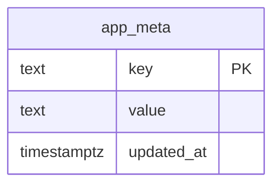
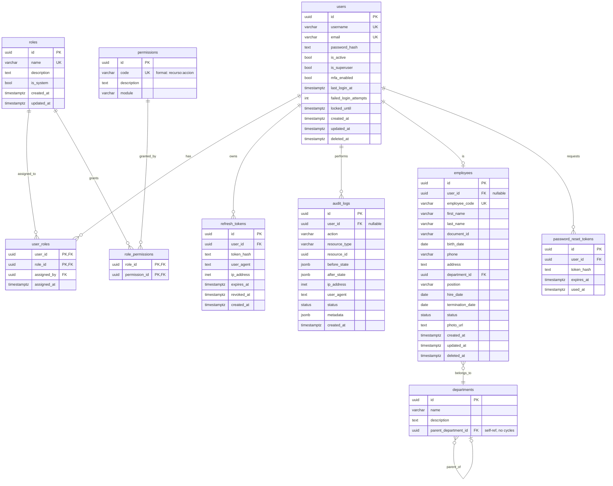

# Database Schema

> **Versión:** `v1.0.0` | **Última actualización:** `22/07/2026`  
> Complete schema design and conventions for PostgreSQL 16.

## 1. Conventions

- **Primary keys:** `UUID` (server-side `gen_random_uuid()`). No int autoincrement.
- **Timestamps:** `TIMESTAMPTZ` everywhere. `created_at` and `updated_at` on every
  entity; `deleted_at` for soft-delete on business entities.
- **Soft delete:** `users`, `employees`, `departments` use `deleted_at`. Hard
  delete is reserved for junction rows where history is captured elsewhere.
- **Naming:** snake_case tables and columns; constraints get stable names via
  Alembic autogenerate + manual review.
- **Audit log:** append-only (`INSERT` only); no `UPDATE`/`DELETE` API surface.

## 2. Phase 0 — current schema (Mermaid)

`app_meta` holds key/value markers (e.g. `schema_phase = 0`) and exists so
migrations are wired end-to-end and verifiable.

## 3. Target schema (Phases 1–4)

## 4. Indexes (target)

| Table | Column(s) | Type |
|-------|-----------|------|
| `users` | `email` | unique, btree |
| `users` | `username` | unique, btree |
| `employees` | `employee_code` | unique, btree |
| `audit_logs` | `created_at` | btree (DESC, for cursor pagination) |
| `audit_logs` | `user_id` | btree |
| `audit_logs` | `(resource_type, resource_id)` | composite btree |
| `refresh_tokens` | `token_hash` | unique, btree |
| `refresh_tokens` | `(user_id, revoked_at)` | partial where `revoked_at IS NULL` |

## 5. Migration policy

- One Alembic revision per logical change. Revisions are reversible
  (`downgrade()` implemented and tested).
- `compare_type` and `compare_server_default` are enabled so autogenerate
  catches type drift.
- Migrations are an explicit one-shot deployment step (see ADR-003 in
  `architecture.md`). The API startup hook remains opt-in for disposable
  environments only; ordinary development and production set
  `RUN_MIGRATIONS_ON_STARTUP=false`.
- `create_all()` is **dev/test only**; production always uses Alembic.

## 6. Warehouse location integrity (revision 0030)

Revision `0030` makes two application invariants enforceable by PostgreSQL:

- `code_scheme_id` and `scheme_version` are either both null (legacy code) or
  both present, in both `locations` and `location_code_aliases`. The existing
  composite foreign keys then validate the exact warehouse-scoped scheme
  version.
- A location is retired if and only if `is_active` is false. Every non-retired
  lifecycle state (`draft`, `active`, blocked variants, or `maintenance`) stays
  active in the persistence model.

The migration runs read-only preflight checks before creating constraints and
aborts without repairing data when it finds an inconsistent row. Operators
must resolve those rows deliberately, rerun the preflight, and only then
promote the migration. Its downgrade drops only the three checks and does not
rewrite business data or permissions.

## 7. Product image galleries (revision 0031)

Revision `0031` adds the normalized `product_images` table. Each product can
have up to 20 ordered images and exactly one cover when the gallery is
non-empty. Cloudinary images reference a staged/active `media_assets` row owned
by the same company; external images are stored as HTTPS references only. The
backend never fetches external image URLs.

The gallery stores `source_type`, URL, optional accessible `alt_text`,
zero-based `position`, and `is_cover`. Product list responses project only
`cover_image` and `image_count`; individual product responses include the
complete ordered gallery. Removed Cloudinary assets are marked `detached` for
the existing cleanup process.

## 8. Supplier and supplier-contact primary images (revision 0032)

Revision `0032` adds one normalized primary image relation for each supplier
and supplier contact. `supplier_images` stores the supplier logo and
`supplier_contact_images` stores the contact avatar. Both tables validate
Cloudinary/external source parity, enforce one relation per owner, and retain
accessible alternative text without storing binary content. Existing supplier
contacts receive a persistent UUID so staged Cloudinary assets can be claimed
with the same owner isolation used by other media flows.

External images are HTTPS references rendered directly by the browser; the API
never downloads or probes those URLs. Cloudinary assets must be staged/active,
belong to the current company, and have the purpose matching the relation.
Removed assets are marked `detached` for the existing cleanup process.
