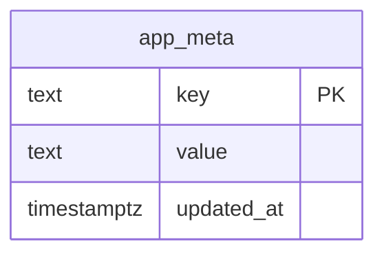

# Database Schema

## Product families and variants (0037)

The catalog keeps the current product as the family parent. `products.variant_mode`
is `standalone` for regular products and becomes `template` when the first
variant is created. Family attributes and allowed values live in
`product_family_attributes` and `product_family_attribute_values`; variants,
their canonical combinations and lifecycle are stored in `product_variants`.
`product_variant_attribute_values` enforces one value per attribute. A variant
may have one primary image in `product_variant_images`.

`product_sku_registry` reserves SKUs across products and variants within a
company. `product_identifiers` now targets exactly one product or variant, so
EAN/UPC/GTIN uniqueness cannot be bypassed by moving between tables. Existing
products are not backfilled into families. The migration is fail-closed on
downgrade when variant data exists.

Variants are catalog identity only in this revision. Inventory, purchasing,
sales, pricing, lot and serial tables must reference `variant_id` only when
those bounded contexts are implemented.

> **Versión:** `v1.0.0` | **Última actualización:** `22/07/2026`  
> Complete schema design and conventions for PostgreSQL 16.

## 1. Conventions

- **Primary keys:** `UUID` (server-side `gen_random_uuid()`). No int autoincrement.
- **Timestamps:** `TIMESTAMPTZ` everywhere. `created_at` and `updated_at` on every
  entity; `deleted_at` for soft-delete on business entities.
- **Soft delete:** `users`, `employees`, `departments` use `deleted_at`. Hard
  delete is reserved for junction rows where history is captured elsewhere.
- **Naming:** snake_case tables and columns; constraints get stable names via
  Alembic autogenerate + manual review.
- **Audit log:** append-only (`INSERT` only); no `UPDATE`/`DELETE` API surface.

## 2. Phase 0 — current schema (Mermaid)

`app_meta` holds key/value markers (e.g. `schema_phase = 0`) and exists so
migrations are wired end-to-end and verifiable.

## 3. Target schema (Phases 1–4)

## 4. Indexes (target)

| Table | Column(s) | Type |
|-------|-----------|------|
| `users` | `email` | unique, btree |
| `users` | `username` | unique, btree |
| `employees` | `employee_code` | unique, btree |
| `audit_logs` | `created_at` | btree (DESC, for cursor pagination) |
| `audit_logs` | `user_id` | btree |
| `audit_logs` | `(resource_type, resource_id)` | composite btree |
| `refresh_tokens` | `token_hash` | unique, btree |
| `refresh_tokens` | `(user_id, revoked_at)` | partial where `revoked_at IS NULL` |

## 5. Migration policy

- One Alembic revision per logical change. Revisions are reversible
  (`downgrade()` implemented and tested).
- `compare_type` and `compare_server_default` are enabled so autogenerate
  catches type drift.
- Migrations are an explicit one-shot deployment step (see ADR-003 in
  `architecture.md`). The API startup hook remains opt-in for disposable
  environments only; ordinary development and production set
  `RUN_MIGRATIONS_ON_STARTUP=false`.
- `create_all()` is **dev/test only**; production always uses Alembic.

## 6. Warehouse location integrity (revision 0030)

Revision `0030` makes two application invariants enforceable by PostgreSQL:

- `code_scheme_id` and `scheme_version` are either both null (legacy code) or
  both present, in both `locations` and `location_code_aliases`. The existing
  composite foreign keys then validate the exact warehouse-scoped scheme
  version.
- A location is retired if and only if `is_active` is false. Every non-retired
  lifecycle state (`draft`, `active`, blocked variants, or `maintenance`) stays
  active in the persistence model.

The migration runs read-only preflight checks before creating constraints and
aborts without repairing data when it finds an inconsistent row. Operators
must resolve those rows deliberately, rerun the preflight, and only then
promote the migration. Its downgrade drops only the three checks and does not
rewrite business data or permissions.

## 7. Product image galleries (revision 0031)

Revision `0031` adds the normalized `product_images` table. Each product can
have up to 20 ordered images and exactly one cover when the gallery is
non-empty. Cloudinary images reference a staged/active `media_assets` row owned
by the same company; external images are stored as HTTPS references only. The
backend never fetches external image URLs.

The gallery stores `source_type`, URL, optional accessible `alt_text`,
zero-based `position`, and `is_cover`. Product list responses project only
`cover_image` and `image_count`; individual product responses include the
complete ordered gallery. Removed Cloudinary assets are marked `detached` for
the existing cleanup process.

## 8. Supplier and supplier-contact primary images (revision 0032)

Revision `0032` adds one normalized primary image relation for each supplier
and supplier contact. `supplier_images` stores the supplier logo and
`supplier_contact_images` stores the contact avatar. Both tables validate
Cloudinary/external source parity, enforce one relation per owner, and retain
accessible alternative text without storing binary content. Existing supplier
contacts receive a persistent UUID so staged Cloudinary assets can be claimed
with the same owner isolation used by other media flows.

External images are HTTPS references rendered directly by the browser; the API
never downloads or probes those URLs. Cloudinary assets must be staged/active,
belong to the current company, and have the purpose matching the relation.
Removed assets are marked `detached` for the existing cleanup process.

## 9. International supplier master data (revision 0033)

`suppliers.name` remains the commercial name and `suppliers.address` remains a
legacy compatibility field. Revision `0033` adds optional legal identity,
company-scoped supplier groups, workflow status/hold dates, currency, payment
terms, payment method and an external reference. Existing suppliers are
backfilled only to `supplier_status = approved`; no tax or legal values are
invented.

Fiscal identifiers live in `supplier_tax_identifiers` and are generic
(`country_id`, `identifier_type`, `value`) so an El Salvador supplier may use
NIT/NRC while an international supplier may use VAT, EIN, RFC or any local
identifier. They are optional, repeatable and normalized for duplicate
detection; only one may be primary per country.

`supplier_groups`, `currencies`, `payment_terms` and `supplier_addresses` are
normalized catalogues/relations. Existing non-empty legacy addresses are copied
to one primary `other` address without deleting the original column.

`supplier_bank_accounts` stores only AES-GCM ciphertext and the last four
digits. The encryption key is supplied by `SUPPLIER_DATA_ENCRYPTION_KEY` from
the deployment secret manager; APIs never return or audit full account numbers,
IBANs, ciphertext or keys. The 0033 downgrade refuses to run while supplier
master data, addresses, banking records or custom catalog rows exist.

## 10. Product measurements (revision 0034)

Revision `0034` normalizes physical product measurements without changing the
commercial `units` catalogue used by purchase and sale units. Products now
store optional `dimension_length`, `dimension_width`, `dimension_height`,
`dimension_unit`, `weight` and `weight_unit` values. Dimension units are the
fixed codes `mm`, `cm`, `m`, `in` and `ft`; weight units are `mg`, `g`, `kg`,
`t`, `oz` and `lb`. PostgreSQL checks reject negative values, unsupported
codes, and measurements without their paired unit.

The former free-text `dimensions` column remains for API compatibility. During
the migration, unambiguous strings such as `20 x 30 x 10 cm` are backfilled
into structured columns; ambiguous values remain in `dimensions_legacy` and
are never discarded. New writes use only structured fields. Volume is derived
at read time in cubic metres from all three dimensions and is never stored as
a user-editable value.

## 11. Deferred product-domain data

Inventory identity, versioned packaging conversions, lightweight handling units,
lots, expiry, movements, balances and capacity reservations are implemented by
revision `0040`. Purchasing documents, landed-cost allocation, price history,
replenishment policies, serial tracking and full regulatory compatibility remain
separate concerns and are not inferred from the physical-capacity model.

## 13. Physical capacity and inventory (revisions 0039–0040)

Revision `0039` removes ambiguous pallet/generic capacity from the forward
schema. Warehouses and storage locations store certified and operational limits
for kilograms and usable cubic metres, a capacity profile, enforcement mode,
storage eligibility and optional usable dimensions. Structural groups represent
shared rack, bay, level, floor or cold-room constraints; location maximums are
not summed to infer structural strength.

Revision `0040` adds inventory identities for standalone products or variants,
versioned packaging definitions, non-nested handling units, immutable movement
headers and lines, materialised balances, expiring capacity reservations and
temporary operational overrides. Movement lines preserve packaging and physical
measurement snapshots so later master-data changes do not rewrite history.

Capacity uses canonical units and computes `projected = occupied + reserved` at
the location, warehouse and applicable structural groups. PostgreSQL constraints
enforce positive limits, operational-at-or-below-certified boundaries, valid
state catalogues and composite item/override references. Company ownership of
locations is resolved through warehouse and branch and is also checked by every
inventory application command. Unknown measurements remain
explicit; they do not contribute a fabricated zero and normal receipt is blocked
until the stock is measured or placed in controlled quarantine.

## 14. Document storage and OCR (revisions 0041–0042)

`document_assets` stores tenant-scoped metadata for immutable private objects. It records the
normalized display name, declared and detected MIME, size, SHA-256, private bucket/key, ETag,
scan state and audited soft-delete fields. The supported states are `pending_upload`,
`pending_scan`, `scanning`, `active`, `quarantined` and `rejected`; only `active` is downloadable.
The unique `(bucket, object_key)` constraint and company/status/date indexes support safe lookup,
maintenance and retention without exposing storage coordinates through the API.

`document_derivatives` records immutable generated objects without changing the canonical
document. Revision `0042` initially supports one `ocr_pdf` per document with states `pending`,
`processing`, `ready`, `failed` and `skipped`; it stores size, SHA-256, ETag, attempts, failure
code and processing timestamps. The unique `(document_id, kind)` constraint makes creation
idempotent, while company/status/date indexes support tenant isolation, reconciliation and stale
job recovery. PostgreSQL—not Redis—is the durable source of processing state.

## 12. Product master enrichment (revisions 0035–0036)

Revisions `0035` and `0036` extend the product master without embedding
transactional inventory or purchasing balances in the catalogue row. Products now have an explicit kind
(`goods` or `service`), lifecycle (`draft`, `active`, `blocked`,
`discontinued`, `retired`), purchase/sale flags, commercial and internal names,
separate descriptions, keywords, origin country, company-scoped brand and
manufacturer references, and physical storage/handling rules. `is_active` is
kept for compatibility and is constrained to match the lifecycle.

`product_brands` and `product_manufacturers` are company-scoped catalogs with
composite tenant-safe foreign keys. Physical storage fields are only valid for
goods; temperature is expressed in Celsius and ranges are checked in the
database.

`product_identifiers` stores optional EAN/UPC/GTIN/ISBN, manufacturer, internal
and generic identifiers. Values are normalized for uniqueness, and only one
primary identifier is allowed per product/type. `product_suppliers` stores the
current sourcing relationship (cost, currency, MOQ, multiple, lead time,
preferred flag and validity), with company-composite foreign keys, one active
preferred supplier per product and constraints for approved suppliers. Price
history, purchasing documents and inventory conversions remain deferred.
